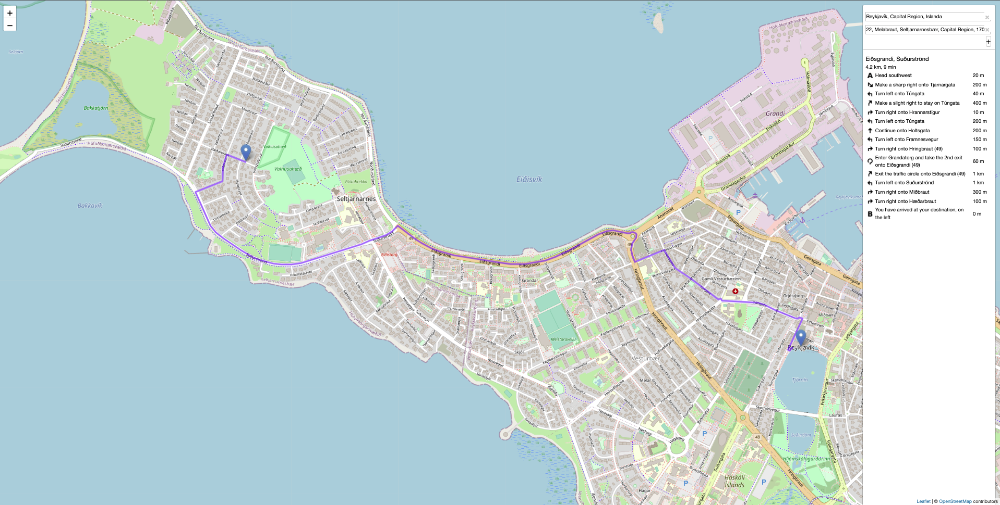

# Hlemmur 🚌
Road network analysis use cases with Leaflet, Leaflet-react, Leaflet control geocoder, OSRM/Valhalla.



## Running OSRM using docker
Preprocessing steps:
```
curl -o osm-data/map.osm.pbf https://download.geofabrik.de/europe/iceland-latest.osm.pbf
docker run -t -v "$PWD/osm-data:/data" osrm/osrm-backend osrm-extract -p /opt/car.lua /data/map.osm.pbf
docker run -t -v "${PWD}/osm-data:/data" osrm/osrm-backend osrm-partition /data/map.osrm
docker run -t -v "${PWD}/osm-data:/data" osrm/osrm-backend osrm-customize /data/map.osrm
```

Server running:
```
docker run -t -i -p 5005:5000 -v "${PWD}/osm-data:/data" osrm/osrm-backend osrm-routed --algorithm mld /data/map.osrm
```

or directly using docker compose:
```
docker-compose -f docker-compose-runner.yaml build
docker-compose -f docker-compose-runner.yaml up
```

## UI Development

In the project directory, you can run:

### `npm start`

Runs the app in the development mode.\
Open [http://localhost:3000](http://localhost:3000) to view it in your browser.

The page will reload when you make changes.\
You may also see any lint errors in the console.

### `npm test`

Launches the test runner in the interactive watch mode.\
See the section about [running tests](https://facebook.github.io/create-react-app/docs/running-tests) for more information.

### `npm run build`

Builds the app for production to the `build` folder.\
It correctly bundles React in production mode and optimizes the build for the best performance.

The build is minified and the filenames include the hashes.\
Your app is ready to be deployed!

See the section about [deployment](https://facebook.github.io/create-react-app/docs/deployment) for more information.

### `npm run eject`
